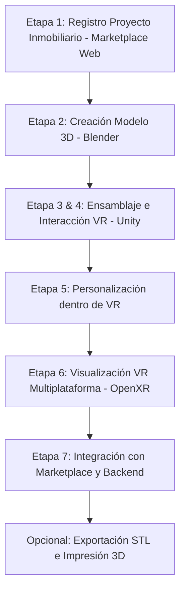

# Propuesta de Proyecto: Sistema Inmobiliario VR con Personalización e Impresión 3D

>D:\unity project\InmobiliariaVR\Docs
> Enfoque: Marketplace Inmobiliario de Preventa + Recorrido Inmersivo VR + Personalización con IA Local + Prototipado para Impresión 3D.

---

## 📌 Aportes de Integrantes

---

### 👤 YOSS

> "No es solamente 'hacer una casa en realidad virtual'. En Ingeniería de Software conviene plantearlo como un **sistema inmobiliario de preventa** con un módulo de personalización 3D/VR y una salida opcional hacia fabricación mediante impresión 3D."

#### 1. ¿Qué hará el sistema?
El flujo general:
$$\text{Inmobiliaria publica proyecto} \longrightarrow \text{Cliente entra al marketplace} \longrightarrow \text{Selecciona departamento/casa} \longrightarrow \text{Visualiza plano y modelo 3D} \longrightarrow \text{Recorrido VR} \longrightarrow \text{Personaliza interiores} \longrightarrow \text{Guarda diseño} \longrightarrow \text{Solicita cotización/reserva} \longrightarrow \text{Salida a impresión 3D}$$

> **Ejemplo de uso:**
> Una inmobiliaria está construyendo un edificio que todavía no existe físicamente. El cliente entra al marketplace, selecciona el Departamento 5B y, en lugar de ver sólo renders, entra virtualmente al departamento. Desde VR puede caminar por los ambientes, observar dimensiones y cambiar elementos como piso, color de paredes, muebles o acabados. Finalmente guarda su configuración y la inmobiliaria elabora una cotización con esos datos.

---

#### 2. Flujo completo del sistema (7 Etapas)



##### Etapa 1. Registro del proyecto inmobiliario (Marketplace Web)
La inmobiliaria registra:
- Proyecto, ubicación, torre/bloque.
- Departamentos o viviendas, $m^2$, precio, estado (*disponible, reservado, vendido*).
- Planos, fotografías, modelo 3D.
*Ejemplo:* Condominio Vista Verde $\rightarrow$ Torre A $\rightarrow$ Dpto A-302 $\rightarrow$ 85 $m^2$ $\rightarrow$ Bs 650.000 $\rightarrow$ Disponible.

##### Etapa 2. Creación del modelo arquitectónico 3D
No se modela la casa en Unity. Se usan herramientas dedicadas como **Blender**, SketchUp o Revit.
- **Recomendación:** Blender + Unity.
- En Blender se modelan: paredes, puertas, ventanas, habitaciones, muebles, iluminación básica y decoración.
- Se exporta en formato **FBX** o **glTF/GLB** e importa en Unity.

---

#### 3. ¿Qué usamos exactamente de Unity?
Unity será el motor de la experiencia interactiva y VR.

| Elemento Unity | Propósito y Aplicación en el Proyecto |
|---|---|
| **Escenas** | Cada inmueble se representa mediante una escena (ej. `Departamento_A302`) que contiene sala, cocina, dormitorios, baños, muebles y luces. |
| **GameObjects** | Todos los elementos estructurados jerárquicamente (`Departamento -> Sala -> [Sofa, Mesa, TV]`) para identificar qué puede modificar el usuario. |
| **Materials** | Cruciales para el cambio de acabados: pisos (porcelanato, madera, cerámica) o paredes (blanca, beige, gris). |
| **Prefabs** | Muebles reutilizables (`Sofa_A`, `Sofa_B`, `Mesa_A`). Permiten cambiar `Sofa_A` $\rightarrow$ `Sofa_B` sin reconstruir la escena. |

---

#### 4. Interacción VR
- **Stack recomendado:** `XR Interaction Toolkit` + `OpenXR`.
- **Estructura:**
  $$\text{Unity} \longrightarrow \text{XR Interaction Toolkit} \longrightarrow \text{OpenXR} \longrightarrow \text{Visor VR}$$
- OpenXR brinda una capa de compatibilidad universal para múltiples marcas de visores.

---

#### 5. Funciones dentro de la Realidad Virtual

- **Recorrer el inmueble:** Mirar alrededor, caminar, teletransportación, desplazarse entre habitaciones mediante locomoción XR.
- **Seleccionar objetos:** Apuntar con los controles VR a sofá, silla, cama, puerta, pared y desplegar menú interactivo (Modelo y Color).
- **Cambiar decoración:** Modificar colores, muebles, materiales, pisos y guardar el diseño resultante.

---

#### 6. Arquitectura de Visualización VR

```
MODELO 3D (Blender / Revit)
       ↓  (Exportación FBX / GLB)
UNITY (Escena + XR Interaction Toolkit + OpenXR)
       ↓
VISOR VR (Recorrido, colisiones, selección y personalización)
```

> **Regla de oro:** *Blender crea el mundo; Unity hace que ese mundo sea interactivo.*

---

#### 7. Integración del Marketplace Web y Backend

```
┌─────────────────────────────────────────┐
│             MARKETPLACE WEB             │
│ Proyectos | Departamentos | Precios     │
│ Reservas  | Ficha técnica | Usuarios    │
└────────────────────┬────────────────────┘
                     │ Inmueble seleccionado
                     ▼
┌─────────────────────────────────────────┐
│              UNITY 3D / VR              │
│ Recorrido virtual | Cambio de muebles   │
│ Cambio de materiales | Personalización  │
└────────────────────┬────────────────────┘
                     │ Configuración personalizada
                     ▼
┌─────────────────────────────────────────┐
│                 BACKEND                 │
│ Guarda configuración | Calcula cotización│
│ Gestiona reserva                        │
└─────────────────────────────────────────┘
```

---

#### 8. El rol de la Impresión 3D
La fabricación 3D genera una **maqueta física del inmueble a escala** (ej. escala 1:50 del Departamento A-302) o elementos personalizados seleccionados por el cliente.

$$\text{Modelo arquitectónico} \longrightarrow \text{Preparación (Watertight/Manifold)} \longrightarrow \text{STL} \longrightarrow \text{Slicer (Cura/Prusa)} \longrightarrow \text{Impresora 3D} \longrightarrow \text{Maqueta Física}$$

> **Alcance:** El núcleo del sistema es *Marketplace + Personalización + VR*; la impresión 3D complementa la experiencia.

---

#### 9. Tabla de Herramientas Recomendadas

| Área | Herramienta / Tecnología |
|---|---|
| **Marketplace** | React o Angular |
| **Backend** | FastAPI / Spring Boot |
| **Base de Datos** | PostgreSQL |
| **Modelado 3D** | Blender |
| **Motor 3D** | Unity |
| **Interacción VR** | XR Interaction Toolkit |
| **Compatibilidad VR** | OpenXR |
| **Lenguaje en Unity** | C# |
| **Formatos 3D** | FBX / GLB |
| **Exportación Impresión** | STL (`pb_Stl` o Blender) |
| **Laminador** | Ultimaker Cura / PrusaSlicer |
| **Control de Versiones** | Git + GitHub |

---

#### 10. Estrategia MVP (Primer Prototipo)
Construir primero una **sala única**:
```
Sala
 ├── paredes
 ├── puerta
 ├── ventana
 ├── sofá
 ├── mesa
 └── televisión
```
**Objetivos del MVP:**
1. Unity carga el modelo.
2. Poder caminar dentro en VR.
3. Seleccionar el sofá y cambiarlo por otro.
4. Cambiar el color/material de una pared.

---

#### 11. Flujo Integral del Negocio

```
INMOBILIARIA registra proyecto y departamentos con planos/3D
       ↓
MARKETPLACE: Cliente busca, selecciona y revisa características
       ↓
VISUALIZACIÓN VR: Recorre, personaliza muebles y colores, guarda diseño
       ↓
BACKEND: Almacena personalización, genera cotización y gestiona reserva
       ↓ (Opcional)
FABRICACIÓN ADITIVA: Exporta STL, lamina y genera maqueta física 3D
```

---

### 👤 JAZMIN

#### Matriz de Fases, Herramientas y Responsabilidades

| Fase del Proyecto | Herramienta / Tecnología | Descripción de la Tarea |
|---|---|---|
| **1. Levantamiento 3D** | SketchUp o Blender | Convierte el plano 2D en geometría 3D. Modela paredes y biblioteca de muebles *Low Poly*. Exporta en `.FBX`. |
| **2. Ensamblaje VR** | Unity 3D | Motor central. Integra modelos, texturas, iluminación optimizada para visores VR. |
| **3. Interacción Física** | XR Interaction Toolkit (Unity) | Manos virtuales, físicas para manipular objetos y teletransporte. |
| **4. Lógica y Eventos** | C# y Visual Studio Code | Scripts que gestionan el cambio de materiales y guardan coordenadas de muebles. |
| **5. Empaquetado 3D** | Exportador STL (`pb_Stl` Plugin) | Fusiona objetos visibles en sus posiciones finales en un archivo `.STL` sólido descargable. |
| **6. Laminado (Slicing)** | Ultimaker Cura | Procesa el `.STL`, define escala de la maqueta y genera el G-Code para la impresora 3D. |
| **7. Control de Versiones** | GitHub y Git LFS | Sincronización del equipo de 5 integrantes y gestión de archivos 3D pesados con Git LFS. |

---

#### Rol de la Inteligencia Artificial Local en el Proyecto

- **Asistente de Diseño (SSD):** El usuario consulta sugerencias de paletas y combinaciones en tiempo real (ej. "¿Qué color de pared combina con una mesa de madera oscura?").
- **Ejecución por Comandos:** Interpretación de comandos en lenguaje natural (ej. "Cambia el piso a color gris") traducidos a acciones en Unity.
- **Interacción por Voz:** Reconocimiento de voz local y respuesta por síntesis nativa (Windows/Unity TTS) para no sobrecargar el hardware.

---

#### Arquitectura Técnica de la IA Local (Ollama + Unity)

```
[Usuario / Micrófono]
         ↓
[Unity: Script C# con UnityWebRequest]
         ↓ POST http://localhost:11434/api/generate
[Ollama Servidor Local (puerto 11434)]
         ↓ Inferencia con Phi-3 / Llama-3 (8B)
[Respuesta JSON: {"respuesta": "#808080"}]
         ↓
[Unity parsea JSON y aplica material dinámicamente]
```

1. **Servidor Local (Ollama):** Corre en `localhost:11434` sin conexión a internet.
2. **Modelo Ligero:** **Phi-3 (Mini)** o **Llama 3 (8B)** (4 a 8 GB de VRAM/RAM).
3. **Estructura de Prompts:** *System Prompt* enfocado en retornar JSON o códigos estructurados (ej. colores hexadecimales o IDs de prefabs).
4. **Conexión en Unity:** `UnityWebRequest` enviando peticiones POST locales asíncronas.
5. **Ejecución In-Game:** Aplicación inmediata de los cambios recibidos en el visor VR.

---

#### Modos de Despliegue Comparados

| Característica | Opción 1: PC VR (Escritorio + Localhost) | Opción 2: Standalone VR (APK + Servidor Local) |
|---|---|---|
| **Complejidad** | Más sencilla de montar. | Requiere configuración de red local (WiFi router). |
| **Frontend** | Ejecutable Windows (`.exe`) en Unity conectado por cable (Quest Link). | Compilado `.apk` instalado directamente en el visor. |
| **Backend & IA** | Corre en `localhost` en la misma PC. | Corre en PC con IP local (ej. `192.168.1.10`), visor consume por red local offline. |
| **Movilidad** | Con cable atado a la PC. | 100% inalámbrico y libre para el usuario. |
| **Impresión 3D** | Directa desde la PC al Slicer. | Visor envía diseño final a la PC y esta manda a imprimir. |
| **Veredicto** | Ideal para prototipo inicial. | **Recomendada para entrega final profesional.** |

---

### 👤 FERNANDO
*(Espacio reservado para aportes y tareas del integrante)*

---

### 👤 SANTIAGO
*(Espacio reservado para aportes y tareas del integrante)*

---

### 👤 FABIAN
*(Espacio reservado para aportes y tareas del integrante)*
